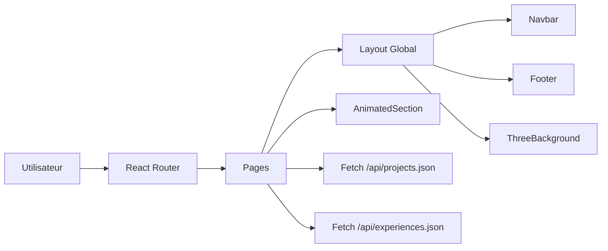

<div align="center">


Application portfolio front-end construite avec React et Vite, orientee experience utilisateur: fond 3D, animations fluides, UI glassmorphism et navigation SPA.

[](https://react.dev)
[](https://vitejs.dev)
[](https://tailwindcss.com)
[](https://threejs.org)
[](https://www.framer.com/motion/)

</div>

## Sommaire

- [Sommaire](#sommaire)
- [Vue Rapide](#vue-rapide)
- [Fonctionnalites](#fonctionnalites)
- [Pages Et Routing](#pages-et-routing)
- [Architecture Technique](#architecture-technique)
- [Structure Du Projet](#structure-du-projet)
- [Installation Et Commandes](#installation-et-commandes)
- [Gestion Du Contenu](#gestion-du-contenu)
- [Licence](#licence)

## Vue Rapide

Le site presente un profil developpeur Full Stack et des projets techniques avec une navigation fluide:

- Accueil: hero, presentation et projets mis en avant
- A propos: parcours et experiences chargees depuis un JSON
- Projets: grille complete des realisations
- Detail projet: page dynamique basee sur le slug
- Contact: informations et formulaire visuel

## Fonctionnalites

| Bloc | Description |
| :--- | :--- |
| Routing SPA | Navigation client avec routes statiques et dynamique `projects/:slug` |
| Data Layer | Chargement des donnees via `fetch` depuis `public/api/*.json` |
| Ambiance visuelle | Fond 3D etoile anime avec React Three Fiber et Drei |
| Motion UI | Animations au scroll via `AnimatedSection` + Framer Motion |
| Interface | Effets glassmorphism, overlay noise, curseur personnalise desktop |
| Responsive | Rendu adapte mobile, tablette et desktop |

## Pages Et Routing

Definition des routes dans [src/App.jsx](src/App.jsx):

| Route | Composant |
| :--- | :--- |
| `/` | `Home` |
| `/about` | `About` |
| `/projects` | `Projects` |
| `/projects/:slug` | `ProjectDetail` |
| `/contact` | `Contact` |

## Architecture Technique



## Structure Du Projet

```text
c:/code/Portefolio
|- public/
|  |- api/
|  |  |- experiences.json
|  |  |- projects.json
|- src/
|  |- components/
|  |  |- AnimatedSection.jsx
|  |  |- Footer.jsx
|  |  |- Layout.jsx
|  |  |- Navbar.jsx
|  |  |- ThreeBackground.jsx
|  |- pages/
|  |  |- About.jsx
|  |  |- Contact.jsx
|  |  |- Home.jsx
|  |  |- ProjectDetail.jsx
|  |  |- Projects.jsx
|  |- App.jsx
|  |- index.css
|  |- main.jsx
|- index.html
|- package.json
|- vite.config.js
```

## Installation Et Commandes

Prerequis:

- Node.js 20+
- npm

Installation:

```bash
npm install
```

Commandes principales:

| Commande | Utilite |
| :--- | :--- |
| `npm run dev` | Lance le serveur de developpement Vite |
| `npm run build` | Genere le build de production |
| `npm run preview` | Previsualise localement le build |
| `npm run lint` | Lance ESLint |

## Gestion Du Contenu

Le contenu fonctionnel du site est pilote par JSON:

- Projets: [public/api/projects.json](public/api/projects.json)
- Experiences: [public/api/experiences.json](public/api/experiences.json)

Note importante:

- La page detail projet utilise le champ slug, qui doit rester unique dans projects.json.

## Licence

Code open source a usage portfolio et inspiration.
Le contenu personnel (identite, textes, projets) reste la propriete de Noan Bregeon.
