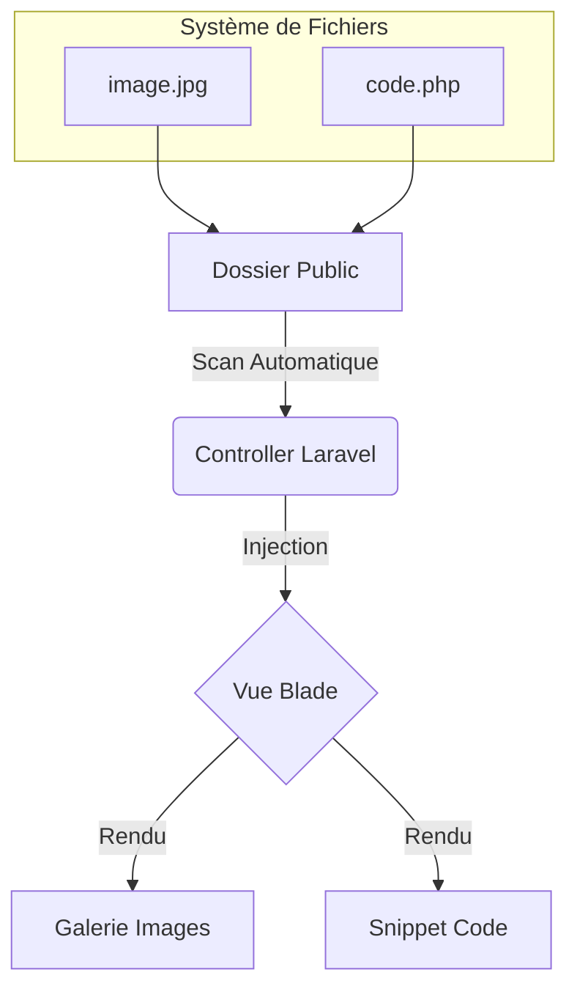

<div align="center">

  

  <br>

  [](https://laravel.com)
  [](https://tailwindcss.com)
  [](https://threejs.org)
  [](https://alpinejs.dev)
  [](https://vitejs.dev)

  <br>
  
  <p align="center">
    <b>Une expérience web immersive alliant performance backend et créativité frontend.</b><br>
    <i>Design sombre • Animations fluides • Architecture propre</i>
  </p>

</div>

---

## 🌌 Aperçu du Projet

Ce portfolio n'est pas qu'une simple vitrine, c'est une **démonstration technique**. Il a été conçu pour prouver qu'un site peut être à la fois beau, interactif et facile à maintenir.

> **"J’aime construire des applications propres, sécurisées et maintenables."**

### 💎 Highlights Visuels
| Fonctionnalité | Description | Techno |
| :--- | :--- | :---: |
| **Univers 3D** | Arrière-plan cosmique interactif avec particules et connexions neuronales. | `Three.js` |
| **Smooth Scroll** | Défilement inertiel ultra-fluide pour une sensation "premium". | `Lenis` |
| **Glassmorphism** | Effets de flou et de transparence (`backdrop-blur`) pour une UI moderne. | `Tailwind` |
| **Micro-Interactions** | Boutons magnétiques, curseur personnalisé, apparitions en cascade. | `GSAP/Alpine` |

---

## 🧠 Architecture Intelligente

Le site utilise une approche **"File-Based Content"** pour simplifier la gestion au quotidien sans base de données complexe pour les médias.



### 🚀 Fonctionnalités "Senior"
*   **Auto-Discovery** : Déposez une image dans un dossier, elle apparaît sur le site.
*   **Code Highlighting** : Déposez un fichier `.php` ou `.js`, il est affiché avec la coloration syntaxique (Atom One Dark).
*   **Performance** : Chargement différé des assets, build optimisé avec Vite.

---

## 🛠️ Stack Technique Détaillée

<div align="center">

| **Backend** | **Frontend** | **Outils** |
| :---: | :---: | :---: |
|  |  |  |
|  |  |  |
|  |  |  |

</div>

---

## 📂 Structure du Code

Une organisation claire respectant les standards MVC.

```bash
c:\code\Portefolio
├── 📂 app
│   └── 📂 Http/Controllers
│       └── 📄 ProjectController.php  # 🧠 Cerveau : Scan les dossiers & gère les données
├── 📂 resources
│   ├── 📂 css
│   │   └── 📄 app.css                # 🎨 Styles globaux & Tailwind
│   ├── 📂 js
│   │   └── 📄 app.js                 # ⚡ Logique Three.js & Alpine
│   └── 📂 views
│       ├── 📂 layouts
│       │   └── 📄 public.blade.php   # 🏗️ Squelette (Head, Scripts, Loader)
│       └── 📂 projects
│           ├── 📄 index.blade.php    # 📋 Liste (Grille animée)
│           └── 📄 show.blade.php     # 🔍 Détail (Galerie + Code Viewer)
└── 📂 public
    └── 📂 images/projects            # 📦 Contenu (Dropzone pour vos fichiers)
```

---

## ⚡ Guide de Démarrage Rapide

Envie de tester le projet localement ?

1.  **Cloner le repo**
    ```bash
    git clone https://github.com/NoanBregeon/portfolio.git
    ```

2.  **Installer les dépendances**
    ```bash
    composer install && npm install
    ```

3.  **Lancer la magie**
    ```bash
    npm run dev
    php artisan serve
    ```

---

## 💡 Gestion de Contenu (CMS-less)

Pas besoin de panel admin complexe. Tout se gère via le système de fichiers.

### 📸 Ajouter des Images
1.  Naviguez vers `public/images/projects/{slug-du-projet}/`.
2.  Glissez vos fichiers (`.jpg`, `.png`, `.webp`).
3.  **Résultat** : Elles s'ajoutent automatiquement à la galerie Lightbox.

### 💻 Ajouter du Code
1.  Dans le même dossier, créez un fichier (ex: `code.php`, `snippet.js`).
2.  Collez votre code.
3.  **Résultat** : Une section "Extrait de Code" apparaît avec la coloration syntaxique et un bouton "Copier".

---

<div align="center">
  <p>Fait avec ❤️ et beaucoup de ☕ par <b>Noan Bregeon</b></p>
  
  [](https://github.com/NoanBregeon)
  [](https://linkedin.com/in/noan-bregeon)
</div>

- **Système de Particules** : Champ d'étoiles animé pour la profondeur.
- **Éclairage Dynamique** : Sources lumineuses colorées (Indigo/Cyan) orbitant autour de la scène.
- **Réactivité** : La scène s'adapte au redimensionnement et reste fluide.

### 2. Interface Utilisateur (UI)
- **Navigation Fluide** : Système d'ancres pour une navigation sans rechargement visible.
- **Glassmorphism** : Utilisation de flous d'arrière-plan (`backdrop-blur`) pour la lisibilité sur le fond 3D.
- **Animations** : Effets d'apparition (`fade-in-up`), curseur personnalisé et indicateurs de scroll.

### 3. Mode Debug
Un mode développeur est intégré pour inspecter la scène 3D.
- **Activation** : Ajoutez `?debug=true` à l'URL.
- **Fonctionnalités** : Active `OrbitControls` pour bouger la caméra, affiche les axes et la grille, et permet le Raycasting (clic sur les objets pour voir leurs noms).

---

## 📂 Contenu du Portfolio (Projets Présentés)

Ce dépôt contient la présentation détaillée de mes projets académiques et personnels :

- **🛒 Projet E6 - Drive & Caisse** : Solution complète (Web Laravel + Client Lourd C#) avec gestion de stock temps réel et infrastructure Debian/AD.
- **🏥 Consultation Médicale** : Application de gestion de rendez-vous (Laravel + PostgreSQL).
- **✈️ Gestion Aéroport** : Système de gestion de terminaux et vols avec modèles Eloquent complexes.
- **🤖 Bots Discord/Twitch** : Automatisation et modération en Node.js.

---

## 🚀 Installation & Démarrage

### Prérequis
- PHP 8.2 ou supérieur
- Composer
- Node.js & NPM

### Étapes
1. **Cloner le projet**
   ```bash
   git clone https://github.com/NoanBregeon/Portefolio.git
   cd Portefolio
   ```

2. **Installer les dépendances**
   ```bash
   composer install
   npm install
   ```

3. **Configuration**
   ```bash
   cp .env.example .env
   php artisan key:generate
   ```

4. **Lancer le développement**
   ```bash
   # Lance Laravel Serve + Vite en parallèle
   composer run dev
   ```

---

## 🛠️ Structure du Code

- `resources/js/three-scene.js` : **Cœur de la 3D**. Contient la scène, la caméra, les lumières et la boucle d'animation.
- `resources/views/layouts/public.blade.php` : **Layout Principal**. Contient le canvas WebGL, le curseur personnalisé et la structure HTML de base.
- `resources/views/home.blade.php` : **Contenu**. Toute la présentation (Hero, About, Projects, Skills) se trouve ici.

---

## 📝 Licence

Ce portfolio est open-source. Le code est libre d'utilisation pour inspiration, mais le contenu (textes, projets, identité) reste la propriété de **Noan Bregeon**.

---
*Généré et maintenu par Noan Bregeon.*
